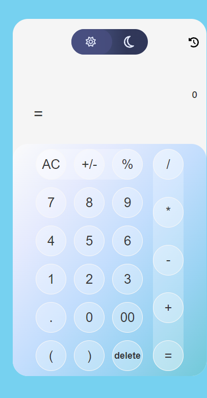
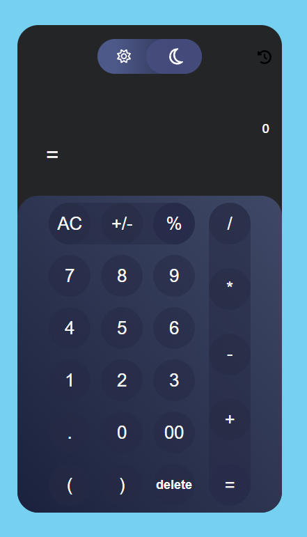

# English

# Angular Calculator Project

This is an Angular calculator application that includes a fully functional keypad, a theme toggle (light/dark mode), and keyboard keydown event handling for user interaction.

## Features

- **Basic Arithmetic Operations**: Addition, Subtraction, Multiplication, Division.
- **Keyboard Support**: Use your keyboard for entering numbers and operations.
- **Light/Dark Theme Toggle**: Switch between light and dark themes with a simple toggle.
- **Responsive Design**: Optimized for both desktop and mobile devices.

## Demo

You can view a live demo of the application [here](https://calculator-brown-phi.vercel.app).

## Installation

To run this project locally, follow these steps:

1. **Clone the repository**:

   ```bash
   git clone https://github.com/your-username/angular-calculator.git
   cd angular-calculator

   ```

2. **Install dependencies**:

   ```bash
   npm install

   ```

3. **Run the application**:
   ```bash
   ng serve
   ```
   The application will be served at http://localhost:4200/.

# Usage

## Calculator

- **Click the buttons:** Use your mouse or touchpad to click the calculator buttons.
- **Keyboard Input:** You can also use your keyboard to input numbers and operations.
  - `+`: Addition
  - `-`: Subtraction
  - `*`: Multiplication
  - `/`: Division
  - `Enter` or `=`: Calculate the result
  - `Backspace`: Clear the last input

## Theme Toggle

- **Toggle Switch:** Use the toggle switch to change the theme between light and dark modes.
- **Automatic Theme Setting:** The toggle switch sets a `data-theme` attribute on the `<body>` element, which is used to apply the appropriate CSS styles.

# Turkish

# Angular Hesap Makinesi Projesi

İşlevsel bir tuş takımı, tema geçişi (açık/karanlık mod) ve kullanıcı etkileşimi için klavye keydown eventleri içeren Angular hesap makinesi uygulaması.

## Özellikler

- **Temel Aritmetik İşlemler**: Toplama, Çıkarma, Çarpma, Bölme.
- **Klavye Desteği**: Sayıları ve işlemleri girmek için klavyenizi kullanın.
- **Açık/Karanlık Tema Geçişi**: Basit bir geçiş ile açık ve karanlık temalar arasında geçiş yapın.
- **Duyarlı Tasarım**: Hem masaüstü hem de mobil cihazlar için optimize edilmiştir.

## Demo

Uygamanın canlı demosunu [buradan](https://calculator-brown-phi.vercel.app) görüntüleyebilirsiniz.

## Önizleme

### Aydınlık Mod | Karanlık Mod

    


## Kurulum

Bu projeyi yerel olarak çalıştırmak için aşağıdaki adımları izleyin:

1. **Depoyu klonlayın**:

   ```bash
   git clone https://github.com/your-username/angular-calculator.git
   cd angular-calculator
   ```

2. **Bağımlılıkları yükleyin**:

   ```bash
   npm install

   ```

3. **Uygulamayı çalıştırın**:
   ```bash
   ng serve
   ```
   Uygulama http://localhost:4200/ adresinde sunulacaktır.

# Kullanım

## Hesap Makinesi

- **Düğmelere Tıklama:** Hesap makinesi düğmelerine fare veya dokunmatik yüzeyle tıklayın.
- **Klavye Butonlarına Tıklama:** Ayrıca klavyenizi kullanarak sayıları ve işlemleri girebilirsiniz.
  - `+`: Toplama
  - `-`: Çıkarma
  - `*`: Çarpam
  - `/`: Bölme
  - `Enter` ya da `=`: Sonuç hesaplama
  - `Backspace`: Silme

## Theme Toggle

- **Toggle Butonu:** Tema arasında geçiş yapmak için Toggle butonunu kullanın.
- **Otomatik Tema Ayarı:** Toggle butonu, uygun CSS stillerini uygulamak için <body> öğesine data-theme niteliğini ayarlar.
